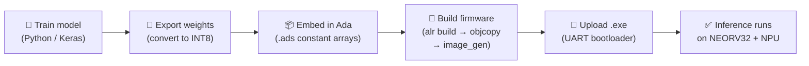

# Wishbone NPU

**A minimal, open-source Neural Processing Unit for RISC-V soft-core SoCs — built from the ground up in VHDL and Ada.**

The Wishbone NPU is a hardware peripheral that accelerates CNN and MLP workloads by performing selected operations in hardware. 
It connects to any softcore with a [Wishbone B4](https://cdn.opencores.org/downloads/wbspec_b4.pdf) bus and offloads common ML operations — dense layers, convolutions, activations, and pooling — to dedicated hardware. Instead of burning CPU cycles on matrix math, you write operands to the NPU, trigger an operation, and read back results.

The reference implementation runs on the [NEORV32](https://github.com/stnolting/neorv32) RISC-V soft-core on a **Lattice ECP5U5MG-85F** FPGA, with an Ada firmware stack and multiple demo applications. 
**The NPU itself is platform-independent VHDL — it works with any Wishbone master on any FPGA.**

Developed as a capstone project at Penn State, sponsored by [AdaCore](https://www.adacore.com/).

---

## Outline
1. Architecture
2. Supported Operations
3. Repository Structure
4. End-to-end Workflow
5. Dependencies
6. Quickstart
7. Using the NPU in Your Own Design
8. Video Guides
9. Related Repositories
10. Contributing
11. Ideas for Improvement
12. Acknowledgments

## Architecture

The NPU Wishbone peripheral is connected to the NEORV32 using the NEORV32's XBUS, which supports the Wishbone communication standard.
All programs run on the NEORV32. The NEORV32 sends data outside of its mapped address range onto the XBUS, allowing it to read/write data and control commands to the NPU. 


---

## Supported Operations

The NPU handles all operations through a single Finite State Machine controlled by opcodes. Data is stored as **4 INT8 values packed per 32-bit word** in on-chip BRAM tensor windows.

| Operation | What It Does | Data Format |
|-----------|-------------|-------------|
| **Dense (INT8 GEMM)** | Fully connected layer (Uses Requantization) | INT8 (Q0.7)|
| **Conv2D** | 2D convolution with 3×3 kernel + bias. Supports multiple input and output channels (Uses Requantization) | INT8 (Q0.7)|
| **ReLU** | max(0, x) on 4 packed INT8 values per word | INT8 (Q0.7) |
| **Sigmoid** | Linear-approximated sigmoid on 4 packed values | INT8 (Q0.7) |
| **SoftMax** | Two-phase: exponents + running sum, then divide | INT8 (Q0.7) |
| **Max Pooling** | 2×2 window → maximum value | INT8 (Q0.7) |
| **Average Pooling** | 2×2 window → average value | INT8 (Q0.7) |

---

## Repository Structure

```
Wishbone-NPU/
├── RTL/                 # Current NPU peripheral (VHDL) — the reusable IP
├── Ada Files/           # Ada firmware: ML driver library + demo applications
├── Python Files/        # Model training (Keras) + weight conversion scripts
├── FPGA Setup/          # NEORV32 board integration (top-level VHDL, .lpf, TCL)
├── ECP5 Files/          # Lattice ECP5-specific build resources
├── Prebuilt Demos/      # Ready-to-flash bitstreams and binaries (no build tools needed)
└── RTL History/         # Archived older versions of the NPU VHDL
```

Each folder has its own README with details on contents and usage.

---

## End-to-End Workflow

This diagram shows how a trained model goes from your PC to running on the FPGA:



**Step by step:**

1. **Train** a model in Python/Keras (see [`Python Files/`](Python%20Files/))
2. **Export** weights to INT8 fixed-point using the weight conversion script
3. **Embed** the exported weights as Ada constant arrays in a firmware project
4. **Build** with Alire → `riscv64-elf-objcopy` → `image_gen` → `.exe`
5. **Upload** via UART bootloader (GTKTerm) → results print to serial console

---

## Dependencies
- **[Specific NEORV32 Fork](https://github.com/GNAT-Academic-Program/neorv32-setups)** - The Ada HAL as on 28th March 2026 only works with this fork of the NEORV32. Please refer to Part 1 of the video guide for installation instructions
- **[NEORV32-HAL](https://github.com/GNAT-Academic-Program/neorv32-hal)** - Base library required to run any Ada Program on the NEORV32
- **[Input-Output Helper Library](https://github.com/dipenarathod/Input-Output-Helper-Library-for-NEORV32-Ada-Projects)** - Required by the NPU Ada library (Ada_ML_Library) in folder Ada files

---

## Quick Start

### Prerequisites

| Tool | Purpose | Install |
|------|---------|---------|
| [Alire](https://alire.ada.dev/) | Ada build system (installs GNAT + RISC-V cross-compiler) | `curl -L https://alire.ada.dev/install.sh \| sh` |
| `image_gen` | Converts binary → NEORV32 executable | Build from [NEORV32 repo](https://github.com/GNAT-Academic-Program/neorv32-setups) `sw/image_gen/` |
| [Lattice Diamond](https://www.latticesemi.com/latticediamond) | FPGA synthesis tool for ECP5U5MG | Free or Paid depending on FPGA. Free 1-year license for ECP5U5MG |
| [GTKTerm](https://github.com/Jeija/gtkterm) | Serial terminal for UART upload | `sudo apt install gtkterm` |
| [Python 3](https://www.python.org/) + [Keras](https://keras.io/) | Model training and weight export | `pip install keras numpy` |
| [GHDL](https://github.com/ghdl/ghdl) + [GTKWave](https://gtkwave.sourceforge.net/) | VHDL simulation and waveform viewing (optional) | `sudo apt install ghdl gtkwave` |

<details>
<summary><strong>Full environment setup (Ubuntu 24.04)</strong></summary>

```bash
sudo apt update && sudo apt -y upgrade
sudo apt install -y build-essential git cmake make python3 python3-venv
sudo apt install -y ghdl gtkwave curl
curl -L https://alire.ada.dev/install.sh | sh
alr index --reset-community
alr toolchain --select
sudo apt install gtkterm

# Build image_gen
git clone --recurse-submodules https://github.com/GNAT-Academic-Program/neorv32-setups.git
cd neorv32-setups/neorv32/sw/image_gen
gcc image_gen.c -o image_gen
sudo cp image_gen /usr/local/bin/
```

Verify: `which riscv64-elf-objcopy && which image_gen && ghdl --version`
</details>

### Build and run a demo

```bash
# Build firmware (example: MNIST 28×28)
cd "Ada Files/ADA_DEMO_FIRMWARE/MNIST_28x28_TEST"   # adjust path to match actual layout
alr build
riscv64-elf-objcopy -O binary bin/test_cases_neorv32 bin/test_cases_neorv32.bin
image_gen -app_bin bin/test_cases_neorv32.bin bin/test_cases_neorv32.exe

# Upload to NEORV32 via UART
# 1. Open GTKTerm:  gtkterm --port /dev/ttyUSB0 --speed 19200
# 2. Set Configuration → CR LF Auto
# 3. Reset board → press 'u' → Ctrl+Shift+R → select .exe → press 'e'
```

### Synthesize the FPGA design

```bash
cd "FPGA Setup"
pnmainc <tcl_script_name>.tcl
```

See [`FPGA Setup/README.md`](FPGA%20Setup/README.md) for full details.

---

## Using the NPU in Your Own Design

The NPU peripheral in [`RTL/`](RTL/) is a self-contained Wishbone B4 slave with **no dependencies** on the NEORV32 or any specific FPGA.

1. Add the NPU VHDL files to your project.
2. Connect its Wishbone slave port to your bus interconnect.
3. Assign it a base address in your memory map.
4. Write data to tensor windows A/B/C, set the opcode in CTRL, assert start, poll STATUS for done, read results from tensor R.

See [`RTL/README.md`](RTL/README.md) for the register map and [`Ada Files/README.md`](Ada%20Files/README.md) for the exact access patterns in code.

---

## Video Guides
- **[Running and Developing Ada Programs on the NEORV32](https://www.youtube.com/playlist?list=PLTuulhiizN0IIO0SsckqQsp6VUrNsisH5)** - How to run Ada programs on the NEORV32
- **[Deploying Models on the NEORV32 + NPU System](https://www.youtube.com/playlist?list=PLTuulhiizN0KNPv-PT1-1Z_EG6jP5cCUH)** - Playlist demonstrating the pipeline to deploy ML Models on the NEORV32 + NPU system
- **[NEORV32 + NPU Guide](https://www.youtube.com/playlist?list=PLTuulhiizN0KFKIZwFJnOU0KGaqpqDNzj)** - Playlist showing how to connect the NEORV32 to the Wishbone NPU in VHDL

## Related Repositories
- **[Central Tutorial Repository](https://github.com/dipenarathod/NEORV32-NGTTDS-YT-Central-Repository)** - Central repository with links to all relevant websites, repositories, and video guides
- **[Wishbone Camera Controller for OV5640](https://github.com/dipenarathod/Wishbone-Camera-Controller-for-OV5640/tree/main)** - Wishbone Peripheral used to interface the Waveshare OV5640 Camera (Version C) with the NEORV32
- **[Wishbone Interconnect 1 Master 2 Slaves](https://github.com/dipenarathod/Wishbone-Interconnect-1-Master-2-Slaves)** - Wishbone Interconnect to connect 2 Wishbone Peripherals to a Master. Video in the repository shows how to connect the NEORV32 (controller) to the camera controller and the NPU (2 slaves)

---

## Contributing

Contributions are welcome — especially ports to new FPGA boards and new NPU operations. Please open an issue or PR.

**Code style**: VHDL formatted with [VHDL Formatter](https://g2384.github.io/VHDLFormatter/), Ada follows GNAT conventions (PascalCase for packages/procedures), Python follows PEP 8.

---

## Ideas for Improvement
1. **Limited storage space for NPU tensors limits model complexity and FPGA deployment:** The NPU’s input, output, weights, and biases tensors are implemented using the BRAM blocks of the FPGA. Tensor sizes dictate the complexity of the operation possible. For example, a Conv2D layer with many output channels (filters) cannot be used with a large input tensor, as the output tensor may fill up quickly. Similarly, a complex network of dense layers with many input-neuron connections can occupy a considerable amount of the weights and biases tensor. Fewer BRAM block availability, such as in cheaper FPGAs, limits us to small tensors, further constraining the complexity of the model that can be deployed on the developed system. Low BRAM block availability also limits if the developed peripherals can be deployed to low-end FPGAs. There are some possible workarounds for limited storage space: 

a. **Integrate a DMA controller inside the NPU:** A DMA controller to interface with external memory devices such as HyperRAM [98] and SRAM [99] can be instantiated inside the NPU peripheral to fetch inputs, weights, and biases as needed. The result can be written to the external memory device as well. This integration allows for more complex models to be deployed and expands the range of FPGAs on which the developed system can be synthesized. However, using a DMA and external memory devices will cause performance drops due to the new read/write latency. 

b. **Use INT4 Q0.3 Quantization:** The NPU uses INT8 Q0.7 numbers, which are 8-bit numbers (7 bits of data and 1 sign bit) quantized from floating-point 32-bit numbers. Transitioning to INT4 Q0.3 numbers, where 3 bits are for data, and 1 bit is the sign bit, we can double the values stored in the same 32-bit word system used in the NPU. There will be an accuracy loss, but memory consumption becomes more efficient. 

2. **Limited computation speed due to a single computation unit in the NPU:** The NPU has one computation unit (FSM) that handles computing the result for any layer (ReLU, Dense, etc). This design choice allows for a simpler implementation but leaves room for performance when FPGA logic elements remain unused. The computation FSM processes up to  4-elements per clock cycle because there are four INT8 elements packed inside a 32-bit board of the NPU. Some solutions to improve computation speed are: 

a. **Create multiple dedicated computation units for each function category:** Instead of one computation FSM, where only up to four elements are processed in a clock cycle, multiple dedicated computation units for each function, so multiple ReLU units and multiple Dense units for example, can be used in tandem to operate on an input tensor/vector simultaneously, increasing parallelism and computation speed.  

b. **Pipeline the computation process:** Presently, only phase of the computation is completed in one clock cycle. This behaviour is due to the implementation of the computation unit as an FSM. The FSM can be decomposed into multiple small processes that execute each clock cycle. Then, using flags and intermediate registers and signals, the computation process can be pipelined for faster computation. 

c. **Use INT4 Q0.3 Quantization:** INT4 Q0.3 storage format allows for storing double the data compared to the INT8 Q0.7 format in the same memory space. Therefore, in each computation FSM, instead of unpacking 4 elements from a 32-bit word of a tensor, we can extract and perform computations on 8 tensor elements.  

---

## Acknowledgments

- **[AdaCore](https://www.adacore.com/)** — industry sponsor; project mentor Oliver Henley
- **[NEORV32](https://github.com/stnolting/neorv32)** by Stephan Nolting — the RISC-V soft-core processor
- **[GNAT Academic Program](https://github.com/GNAT-Academic-Program/neorv32-setups)** — NEORV32 + Ada integration
- **[GEMMLowp Quantization/Requantization Guide](https://github.com/google/gemmlowp/blob/master/doc/quantization.md)** — Quantization/Requantization Guide
- **Penn State University** — Capstone course, instructor/advisor Naseem Ibrahim
